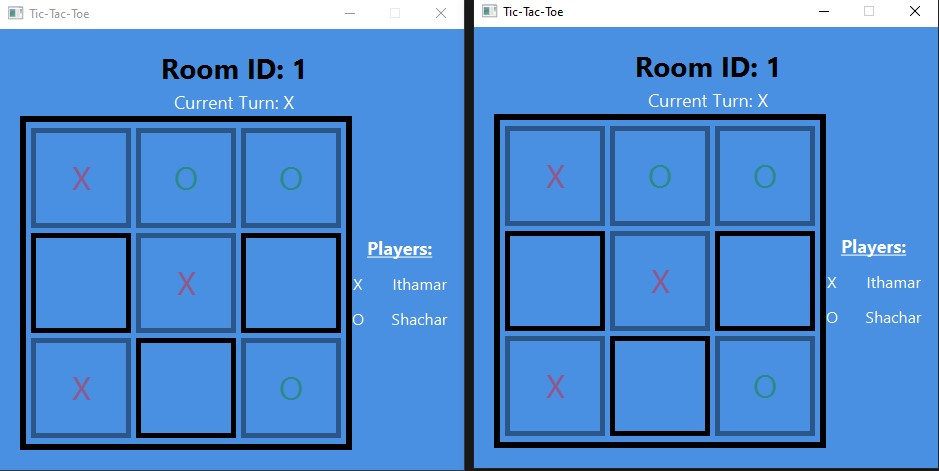
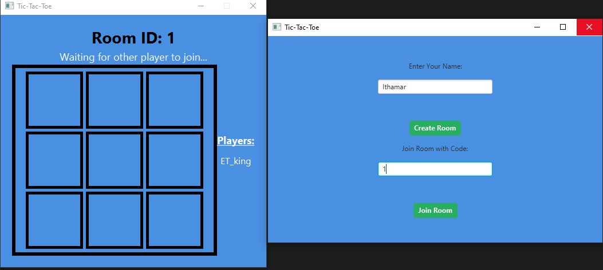
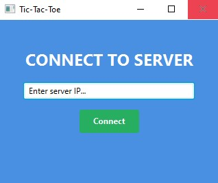

## Overview
This is a JavaFX-based **Multiplayer Tic-Tac-Toe** game. The project utilizes **Java Sockets** for networking, **JavaFX** for the user interface, and follows a structured packet-based communication protocol between client and server.

## Features
- **Multiplayer Support**: Two players can join a room and play Tic-Tac-Toe over a network.
- **JavaFX UI**: Clean, modern, and responsive UI with intuitive controls.
- **Packet-Based Communication**: The server and clients communicate using a structured packet protocol.
- **Game State Management**: The server keeps track of game states, turns, and validates moves.
- **Persistent Score Tracking:** The server keeps track of the number of times X and O have won using a simple database, using JDBC

## Architecture
- **Server**: Handles client connections, manages game rooms, and enforces game rules.
- **Client**: Provides a GUI to interact with the game and sends/receives updates from the server.
- **Game State Management**: Tracks player moves, validates turns, and determines game outcomes.
- **Database Integration**: Uses JSON as a lightweight database to track game statistics.

## Folder Structure
```
/src
│── com.example.demo1
│   ├── Main.java                 # Main application entry point
│   ├── Server.java               # Server-side logic
│   ├── Client.java               # Client-side logic
│   ├── ConnectController.java     # Handles room joining/creation UI
│   ├── RoomController.java        # Handles the game UI
│   ├── GameState.java             # Manages the Tic-Tac-Toe board state
│   ├── GameResultController.java  # Displays the game results (win/loss/draw)
│   ├── HelloController.java       # Displays the connection screen (input IP)
│   ├── DatabaseManager.java       # Manages persistent game statistics
│── resources
│   ├── com.example.demo1
│   │   ├── hello-view.fxml        # Welcome screen
│   │   ├── ctg.fxml               # Room connection screen
│   │   ├── room.fxml              # Tic-Tac-Toe game screen
│   │   ├── game-result.fxml       # Game result screen
```

## Communication Protocol
Each packet follows the format:
```
[PacketID | Data]
```
### Packet Examples (server side):
- `0, "Hello Server"` → Handshake
- `1, roomID, player1, player2` → Room join/update
- `2, playerName` → Create room
- `3, row, col, symbol` → Player move
- `4, ""` → Game End

## Database Integration
The game uses a simple JSON-based database for tracking wins instead of a traditional SQL database. The DatabaseManager.java class manages this.

### Database Operations:
- **Initialize Database** : Creates a game_stats.json file if it doesn’t exist and initializes it with X_Wins: 0, O_Wins: 0, and Draws: 0.

- **Update Score** : Whenever a player wins or a draw occurs, the corresponding count in the JSON file is incremented.

- **Fetch Scores** : Retrieves the total number of X wins, O wins, and draws from the database.

**Example JSON File** (`game_stats.json`):
```
{
  "X_Wins": 12,
  "O_Wins": 9,
  "Draws": 3
}
```


## How to Use
1. **Run the Server**: Start `Server.java` to initialize the server.
2. **Launch the Client**: Run `Main.java` to start the JavaFX UI.
3. **Connecting to the Game**:
   - Enter the **server IP address** on the welcome screen and connect.
   - Choose to **Create a Room** (becomes Player 1) or **Join a Room** with a valid Room ID.
4. **Playing the Game**:
   - Players take turns clicking on cells to place their marks (`X` or `O`).
   - The game ends when a player wins or the board is full.
5. **Game End & Exit**:
   - A game result screen will show the winner or a draw.
   - Click **Exit** to leave the game and disconnect from the server.
   - The game statistics are updated and stored in `game_stats.json`.

## Screenshots

### Game Board in Action  


### Room Selection and Joining  


### Game Result Screen  


### Server Connection Screen  


## Notes
I built this while being very busy with other assignments and exams. for that reason, some features are "flunky" and there are better approaches to doing them.
They might be improved later on.


